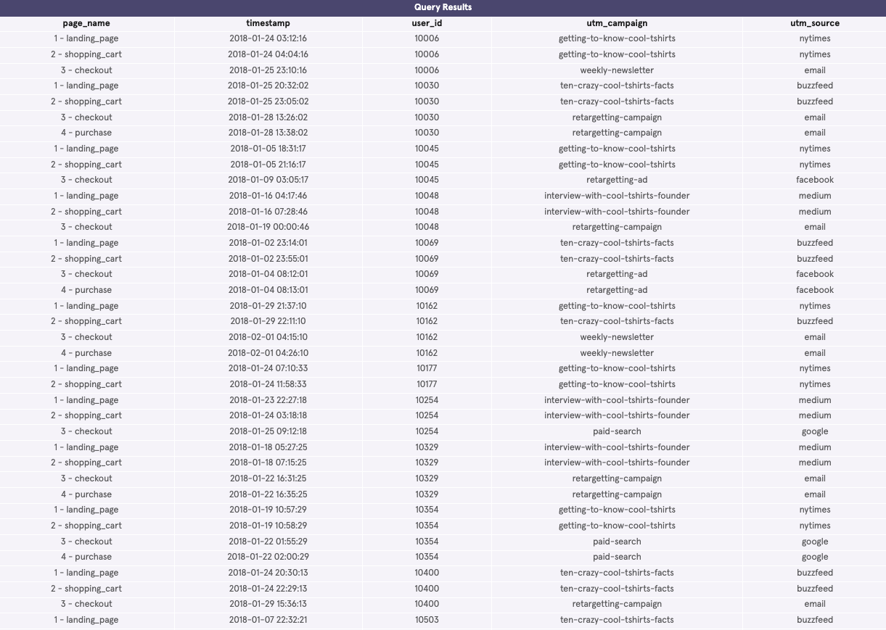

# 🛍️ CoolTShirts Marketing Campaign Analysis

This project analyzes marketing campaign data for **CoolTShirts**, an apparel company running multiple online campaigns.  
The goal is to **understand user journeys**, evaluate **campaign effectiveness**, and recommend which campaigns to reinvest in.

---

## 📊 Project Overview

CoolTShirts runs campaigns across various sources (Google, Facebook, Email, etc.) to attract visitors and drive purchases.  
Using SQL queries, we explore:

### 1. Campaigns and Sources
- How many campaigns and sources exist?  
- How are campaigns linked to sources?  
- What pages are on the website?  

### 2. User Journey
- Which campaigns bring the most **first touches** (initial visits)?  
- Which campaigns are responsible for **last touches** (final visit before exit)?  
- How many visitors make a purchase?  
- Which campaigns close the most **purchases**?  
- What is the typical user journey through the website?  

### 3. Campaign Optimization
- Identify **5 campaigns** worth reinvesting in.  
- Recommendations are based on:  
  - First touches  
  - Last touches  
  - Purchase attribution  

---

## 🗂 Dataset

The original dataset is too large to upload to this repository, so here’s a snapshot used for analysis:



The dataset includes website visit records with the following columns:

| Column        | Description                                                                 |
|---------------|-----------------------------------------------------------------------------|
| `page_name`   | Page visited (`landing_page`, `shopping_cart`, `checkout`, `purchase`)     |
| `timestamp`   | Time of the visit                                                          |
| `user_id`     | Unique visitor identifier                                                  |
| `utm_campaign`| Campaign name (e.g., `getting-to-know-cool-tshirts`)                       |
| `utm_source`  | Traffic source (e.g., `facebook`, `google`, `email`)                       |

---

## ⚙️ SQL Steps

We use SQL queries to answer the key business questions:

1. **Explore campaigns & sources**
   - Count distinct campaigns and sources  
   - Map campaign-to-source relationships  
   - List distinct website pages  

2. **Attribution analysis**
   - Attribute **first touches** (earliest campaign per user)  
   - Attribute **last touches** (latest campaign per user)  
   - Count total purchases  
   - Attribute **last touches on purchases** (campaigns driving conversions)  

---

## ▶️ How to Run

1. Clone this repository:  
   ```bash
   git clone https://github.com/yourusername/cooltshirts-marketing-analysis.git

2. Open your SQL environment (SQLite, PostgreSQL, or any SQL client).
3. Load the dataset into a table named page_visits.
4. Run the SQL scripts in order.
